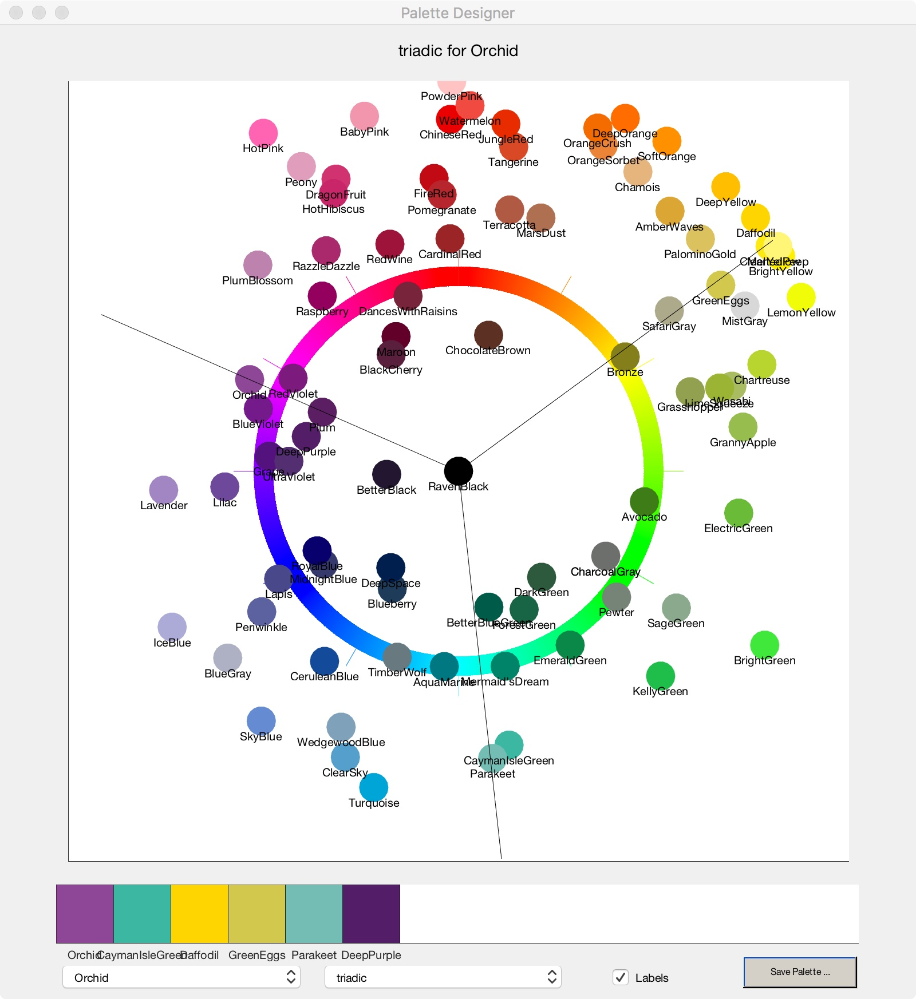

# COLOR DESIGNER #

Version: 2019-02-27.1

Facilitate choosing colors for design.

Using a flattening of the HSL model, identify other colors on a list that are appropriate selections for the design of a brochure, house 
painting, tie dye, etc.  Draw a hue wheel, and then draw darker colors in the list inside the wheel and lighter colors outside.  Then using
baseColor as a starting point, draw lines on the wheel that indicate other colors that go with the baseColr based on traditional color schemes, 'complimentary', 'triadic, etc.

*Args:*

- colorNames: a cell array of n color names
- colrs: an n x 3 array of colors, where each m color's name is colorNames{m}, specified in RGB where each component is in range 0-255.
- baseColor: is the name of one of the colors in colorNames
- schema: is one of the classic color schemes: 'warm'; 'cool'; 'analogous'; 'triadic'; 'tetradic'; 'split complements'; or 'monochromatic'.

**Status:**

Tested in Matlab, soon to be tested in Octave.

**TODO:**

- Include a few more sample color catalogs.
- Finish out 'neutrals' scheme.
- Size palette (Position) to match square swatches
- Move global variables into class, attach at fig.UserData

**Example:**

Choosing a base color of Orchid (Procion tie dye), and a scheme of triadic:

`colorWheel(colors{1},RGB,'Orchid','triadic')`

we get:

Looks like using a tridaic scheme, Deep Yellow, and Cayman Isle Green might be good 2nd & 3rd matches.

**Ref::**

[Dharma Trading Co.](https://www.dharmatrading.com/dyes/)

**Release Notes:**

2019-02-18.2 Corrected a mistaken color gamut error (P3 vs native) that dulled everything.
2019-02-27.1 Added GUI, switched state into global variables
